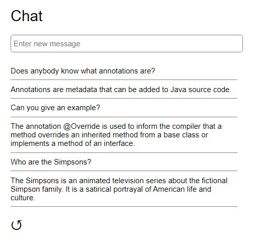
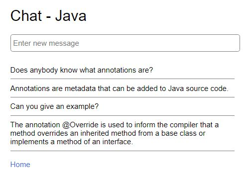

# BTI1301 Web Programming - Mock Exam

## Introduction

This repository contains the implementation of a simple chat application with which users can exchange messages.

Users can enter new messages which are sent to the server after pressing the enter key. The current messages can be fetched from the server by clicking on the refresh icon.

Each message belongs to a topic, and the goal of the following tasks is to make the topic of messages visible. The REST interface and the single-page application are to be extended for this purpose.

**Note**: Comprehensive error handling with appropriate status codes and informative error messages is expected, and code quality in general is relevant.

## REST Interface

### Task 1: Fetch messages on a topic (6 points)

- Add the method `getMessages(topic)` to the `ChatService`, which returns a list of all messages on the specified topic.
- Modify the `doGet()` method of the `MessageServlet` so that the following REST request can be used to fetch the chat messages on a specific topic:
  
  `GET /api/messages?topic={topic}`
    
  If the topic parameter is missing or empty, all chat messages should be returned.

### Task 2: Fetch the topics (6 points)

- Add the `getTopics()` method to the `ChatService`, which returns a list of the topics of all chat messages (without duplicates).
- Implement an additional `TopicServlet` that can be used to fetch the existing chat topics with the following REST request:
  
  `GET /api/topics`
  
  The topics should be returned as a JSON array of strings.

### Task 3: Deleting a message (8 points)

- Add the method `removeMessage(id)` to the `ChatService`, which removes the chat message with the specified identifier.
- Extend the `MessageServlet` so that a chat message can be deleted with the following REST request:
  
  `DELETE /api/messages/{id}`
  
- Implement a filter so that only users with the username "admin" and password "12345" are allowed to delete messages.

## Single-Page Application

### Task 4: Fetching messages and topics (2 points)

- Modify the `getMessages()` method of the `service` object so that only messages of a specific topic are fetched from the server (see task 1).
- Add a method `getTopics()` with which all chat topics can be fetched from the server (see task 2).

### Task 5: Selecting a topic (8 points)

- Implement a new component `home`, which is displayed when the application is started:

  

  The component contains a selection list with all existing topics. Immediately after selecting a topic, the `chat` component with the selected topic shall be displayed.

### Task 6: Messages on the selected topic (2 points)

- Modify the `chat` component so that only messages on the selected topic are displayed and new messages are assigned to the selected topic (before they are sent to the server).
- Add the selected topic to the title and add a link that leads back to the `home` component.

  

### Task 7: Entering a new topic (4 points)

- Add an input field to the `home` component with which a new topic can be entered:

  

  Immediately after pressing the enter key, the `chat` component with the new topic shall be displayed.

### Task 8: Automatic refresh (4 points)

- Remove the refresh icon from the `chat` component and start a timer instead, which fetches the messages from the server every 10 seconds.
- Register an event handler on the `home` link, which stops the timer again.
